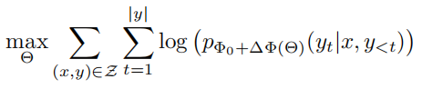
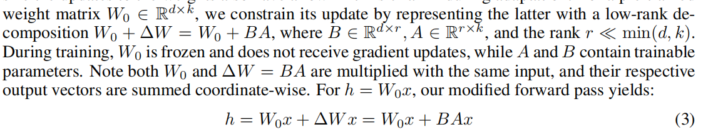
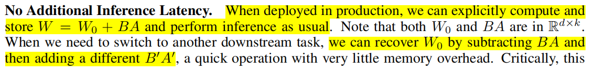

Fine Tuning models such as GPT-3 ( 175B ) from scratch requires lot of compute which is very costly. **Lo**w **R**ank **A**daptation ( **LoRA** ) freezes the pretrained model weights & injects trainable rank decomposition matrices. These matrices are injected into each layer of the Transformer architecture. This reduces the number of trainable parameters for downstream tasks.

> Compared to GPT-3 175B fine-tuned with Adam, LoRA can reduce the number of trainable parameters by 10,000 times and the GPU memory requirement by 3 times.
> 

LoRA allows us to train some dense layers in a neural network indirectly by optimizing rank decomposition matrices of the dense layers’ change during
adaptation instead, while keeping the pre-trained weights frozen

**Advantages**
    
→ A pre-trained model can be shared to build LoRA modules for different tasks. We can freeze the shared model and efficiently switch tasks by replacing the matrices *A* and *B,* reducing the storage requirement and task-switching overhead significantly.

→ LoRA makes training more efficient and lowers the hardware barrier to entry by up to 3 times when using adaptive optimizers since we do not need to calculate the gradients or maintain the optimizer states for most parameters. Instead, we only optimize the injected, much smaller low-rank matrices.

→ The simple linear design allows us to merge the trainable matrices with the frozen weights when deployed, *introducing no inference latency* compared to a fully fine-tuned model, by construction.

→ LoRA is orthogonal to many prior methods and can be combined with many of them, such as prefix-tuning.
    

Read From [here](https://www.ml6.eu/blogpost/low-rank-adaptation-a-technical-deep-dive#:~:text=The%20main%20idea%20behind%20LoRA,a%20low%2Drank%20matrix%20i.e.) and explain details of LoRA

---

During full fine-tuning, the model is initialized to pre-trained weights Φ0 and updated to Φ0 + ∆Φ by repeatedly following the gradient to maximize the conditional language modeling objective:

One of the main drawbacks for full fine-tuning is that for *each* downstream task, we learn a *different* set of parameters ∆Φ whose dimension *|*∆Φ*|* equals *|*Φ0*|*.

If a model has weight matrices of size WxH then the delta will also be of the same dimension. Therefore, while finetuning if there is a model with dimension 175B then the delta will also require a storage space to save these gradients of size 175B before updating the weights.

Moreover, storing and deploying many independent instances of fine-tuned models can be challenging, if at all feasible.

In this paper, we adopt a more parameter-efficient approach, where the task-specific parameter increment ∆Φ = ∆Φ(Θ) is further **encoded by a much smaller-sized set of parameters** Θ with *|*Θ*| << |*Φ0*|*. 

The task of finding ∆Φ thus becomes optimizing over Θ:

The authors propose to use a low-rank representation to encode ∆Φ that is both **compute- and memory-efficient**. 

When the pre-trained model is GPT-3 175B, the number of train able parameters *|*Θ*|* can be as small as 0*.*01% of *|*Φ0*|* ( 175B → 17.5M ).

Aren’t Existing Solutions Good Enough?

This issue has been there since *Transfer Learning* 

Many techniques have been developed trying to tackle this. From Language Modelling POV, there are two strategies:

→ Adding Adapter layers

→ Optimizing some forms of the input layer activation

However, there are limitations to them

**Adding Adapter layers** → Introduces Inference Latency

→ One can think of reducing the latency by either pruning the layers or by exploiting multi-task settings but there is no direct way to bypass the extra compute that the adapters add in. It might seem that its fine as the adapters have few parameters (almost < 1% of the model) due to bottleneck dimensions, which limits the FLOPs they can add. Large Neural Networks rely on GPU parallelism to keep the latency low, **adapter layers have to be processed sequentially**. On performing inference using GPT-2 medium on a single GPU (scenario without model parallelism),

we see a noticeable increase in latency when using adapters, even with a very small bottleneck dimension

---

**LoRA**

→ LOW-RANK-PARAMETRIZED UPDATE MATRICES

A neural network contains many dense layers which perform matrix multiplication. The weight
matrices in these layers typically have **full-rank.**

**Lets check out Ranks first**
    
Matrix Rank

The **rank of a matrix** is the dimension of the vector space generated by its columns, which is given by the **number of linearly independent columns (or rows) in a given matrix.** 

It can be proven that the number of independent columns (known as *column rank)* is always equal to the number of independent rows (called *row rank)*. Hence, for a matrix ***A*** with ***m*** rows and ***n*** columns (represented as ***Aₘₙ**)*,

**Linear Dependence & Independence**

In the theory of [vector spaces](https://en.wikipedia.org/wiki/Vector_space), a [set](https://en.wikipedia.org/wiki/Set_(mathematics)) of [vectors](https://en.wikipedia.org/wiki/Vector_(mathematics)) is said to be **linearly independent** if there exists no nontrivial [linear combination](https://en.wikipedia.org/wiki/Linear_combination) of the vectors that equals the zero vector.

→ Linear Dependent

→ Linear Independent

Can only be satisfied if a(i) = 0 for i = 1,…,n
    

Based on these Ranks matrices can be classified into 2 types:

→ Full Rank

A matrix ***Aₘₙ*** is called a **full-rank matrix** if ***rank(A) =* *min(m, n)*.** The matrix shown below is an example of a full rank matrix.

→ Rank Deficient

The opposite of a full rank matrix is **rank deficient** i.e. ***rank(A)* < *min(m, n)***. The rank-deficient matrix shown below has a rank of ***1***, as the columns (or rows) of the matrix are not linearly independent of one another.

*L**ow-Rank Matrix**: A rank-deficient matrix **Aₘₙ** is called a low-rank matrix if its rank is significantly lower (no fixed threshold) than the minimum number of rows and columns. Mathematically, **rank(A) << min(m, n)**.*

Rank Decomposition

Rank decomposition or factorization of a matrix ***Aₘₙ*** is the factorization of ***A*** of the form ***A*** ***= CₘᵣFᵣₙ*** where ***rank(A) =* *r***. It can be proven that every (finite) matrix has a rank decomposition. 

Techniques like SVD (Singular Value Decomposition) can be used to construct such a decomposition.
    

When adapting to a task the pretrained model weights have “low intrinsic dimensions”. When adapting to a specific task (fine-tuning) we just randomly project it to a smaller subspace still it learns efficiently. Hence it can be hypothesized that the change in weights (update) also has a “low intrinsic dimensions/rank”. 

Therefore, we can use rank decomposition for the change in weights.

E.g.

If d = 100 & k = 100

then d * k = 10000

Now, if r ~ 5

then ( d * r ) + ( r * k ) = ( 500 ) + ( 500 ) = 1000

Its clear that how this reduces the storage requirements.

Initial Initialization,

A → Random Gaussian initialization

B → 0

Therefore, initially AB → 0. Moreover, it also scaled by (*alpha / rank*)

Where *alpha* is a constant (this is set to the first selected rank). This helps to reduce the need to retune hyperparameters when varying *rank*

Latency

Instead of saving 2 entire different models we use a shared pretrained model with task related adapters.

**Practical Benefits & Limitations**

→ The most significant benefit comes from the reduction in memory and storage usage as we do not need to store the optimizer states for the frozen parameters. This saves a lot of VRAM.

→ The size of the checkpoint also significantly reduces. 

→ Another benefit is that we can switch between tasks while deployed at a much lower cost by only swapping the LoRA weights as opposed to all the parameters.

For GPT 3 175B, a speedup of 25% was observed for training compared to full fine-tuning.

Limitations

→ It is not straightforward to batch inputs to different tasks with different *A* and *B* in a single forward pass.

---

Storage Reduction

**UNDERSTANDING THE LOW-RANK UPDATES**

WHICH WEIGHT MATRICES IN TRANSFORMER SHOULD WE APPLY LORA TO?

This is for GPT 3 175B, the budget for trainable parameters is set to 18M which ~ 35MB in FP16 storage.

The above figure shows us that:

→ Wq, Wv ~ Gives the best performance.

The figure suggests that even a rank of four captures enough information in ∆*W* such that it is preferable to adapt more weight matrices than adapting a single type of weights with a larger rank.

WHAT IS THE OPTIMAL RANK *r* FOR LORA?

LoRA already performs competitively with a very small *r* (more so for *{Wq, Wv}* than just *Wq*)

This suggests the update matrix ∆*W* could have a very small **intrinsic rank**

To further support this finding, the authors checked the overlap of the subspaces learned by different choices of *r* and by different random seeds.

The authors argue that increasing *r* does not cover a more meaningful subspace, which suggests that a low-rank adaptation matrix is sufficient.

HOW DOES THE ADAPTATION MATRIX ∆*W* COMPARE TO *W* ?

Note: There are detailed figures regarding these studies in the Appendix section of the paper

Conclusion from the above figure:

→ ∆*W* has a stronger correlation with *W* compared to a random matrix, indicating that ∆*W* amplifies some features that are already in *W*.

→ ∆*W ~ 0.32 | W ~ 21.67*

→ Random ~ 0.02 | *W ~ 21.67*

→ Instead of repeating the top singular directions of *W*, ∆*W* only *amplifies directions that are not emphasized in W.*

→ The amplification factor is rather huge: 

→ 21*.*5 *≈* 6*.*91*/*0*.*32 for *r* = 4 when compared to *r* = 64

This suggests that the low-rank adaptation matrix potentially ***amplifies the important features for specific downstream tasks that were learned but not emphasized in the general pre-training model***.